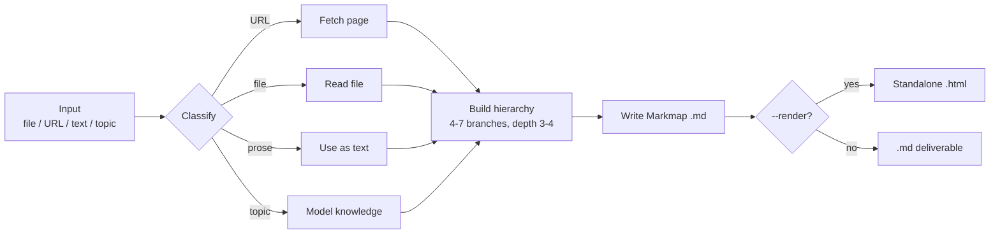
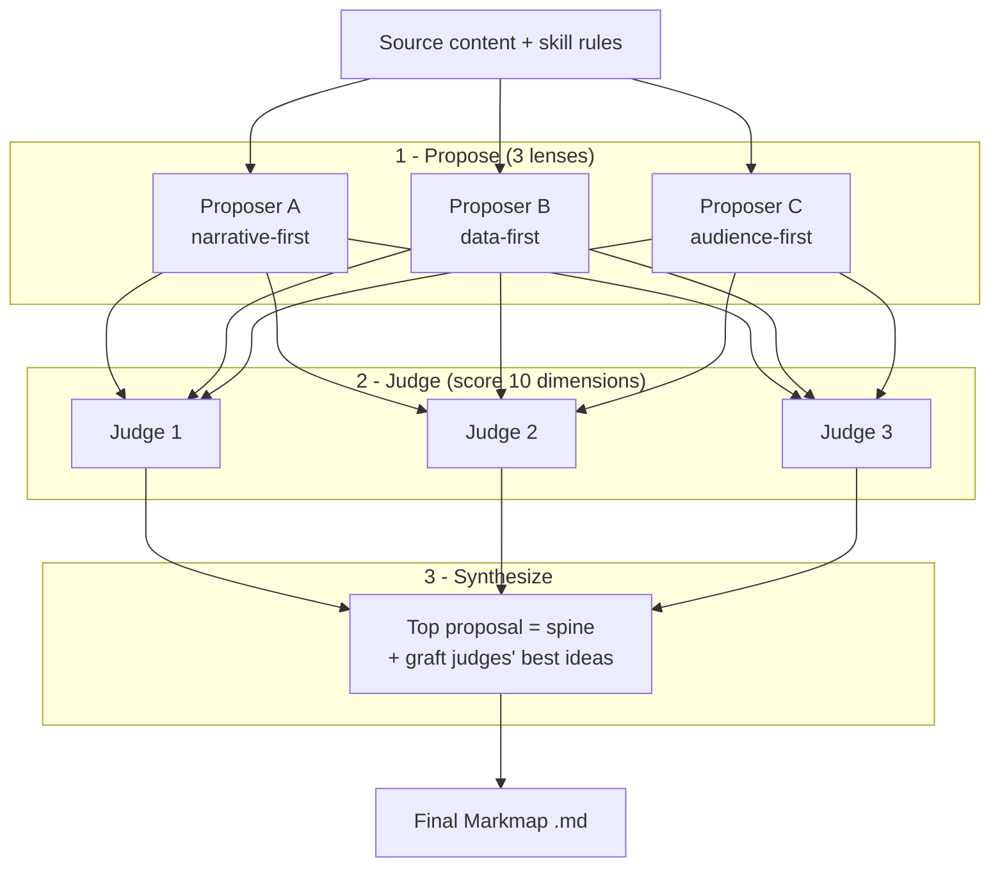

<div align="center">

# 🧠 mindmap

**Understand anything at a glance — turn a file, a URL, or a topic into a zoomable mindmap without leaving your AI coding agent.**

[English](README.md) · [中文](README.zh.md)

[](LICENSE)
[](#-install)
[](https://markmap.js.org)
[](#-install)

</div>

`mindmap` is a plugin for [Claude Code](https://docs.claude.com/en/docs/claude-code) and [GitHub Copilot](https://docs.github.com/copilot/concepts/agents/copilot-cli). Point it at a dense report, a long article, or just a topic, and it distills the key ideas into a clean, zoomable [Markmap](https://markmap.js.org) mindmap — right from your terminal.

> Two languages in one plugin: `/mindmap` (English) and `/mindmap-zh` (中文).

### From any source to a map — in one command



---

## 👀 See it

One command turns a long GitHub blog post into a mindmap:

```
/mindmap https://github.blog/ai-and-ml/how-we-made-github-copilot-cli-more-selective-about-delegation/ --render
```

A ~1,500-word article becomes a structure you can read in seconds:

```
# Smarter Subagent Delegation
├── The Problem
│   ├── Delegation is powerful but not free
│   └── Unnecessary handoffs, overlapping searches, waiting
├── The Approach
│   ├── Analyze → find the delegation bottleneck
│   ├── Change → handle focused work directly
│   └── Validate → offline, then online, then ship
├── Results
│   ├── Tool failures per session −23%
│   └── Wait time −5% P95, no quality regression
└── What's Next
```

That's real output — see [`examples/`](examples/) for the full Markmap `.md` plus the rendered interactive `.html` (open in any browser to zoom and collapse branches).

**▶ [Open the live interactive mindmap](https://galiacheng.github.io/mindmap-skills/examples/copilot-cli-selective-delegation.mindmap.html)** — no install, just click.

---

## ✨ Why use it

- **Grasp dense material fast** — collapse a 3,000-word report into 5–7 branches you can scan at a glance, instead of reading top to bottom.
- **One command, any source** — a file, a URL, pasted notes, or just a topic. No copy-pasting into a separate web tool.
- **Stays in your workflow** — runs inside Claude Code / GitHub Copilot; the map lands as a file right next to your work.
- **Smart structure, not a text dump** — mirrors a structured doc's outline, or distills loose prose into 4–7 concise branches. Nodes are short phrases, not sentences.
- **Portable, interactive output** — standard Markmap `.md` that opens anywhere, plus an optional standalone `.html` you can share.

**Good for:** skimming research papers and reports · digesting blog posts and docs · outlining a topic before you write · turning meeting notes into a shareable map.

---

## 📦 Install

The same repo is a valid plugin for **both** Claude Code and GitHub Copilot — they share the plugin/marketplace format.

### Claude Code

```
/plugin marketplace add https://github.com/galiacheng/mindmap-skills.git
/plugin install mindmap@mindmap-marketplace
/reload-plugins
```

> The explicit `https://` URL avoids an SSH clone. The `galiacheng/mindmap-skills` shorthand also works **if** you have GitHub SSH keys configured; otherwise it fails with `Permission denied (publickey)`.

### GitHub Copilot

```bash
copilot plugin marketplace add galiacheng/mindmap-skills
copilot plugin install mindmap@mindmap-marketplace
```

Then run `/mindmap` in your session. On GitHub Copilot the skill uses the same workflow; tool names map automatically (see [`skills/mindmap/references/copilot-tools.md`](skills/mindmap/references/copilot-tools.md)).

The marketplace manifest lives at [`.claude-plugin/marketplace.json`](.claude-plugin/marketplace.json).

### Manual (local, no marketplace)

Copy the skill into your project's (or user-level) skills directory:

```bash
# project-local
mkdir -p .claude/skills
cp -r skills/mindmap .claude/skills/

# or user-level (available in every project)
mkdir -p ~/.claude/skills
cp -r skills/mindmap ~/.claude/skills/
```

Then run `/reload-skills` (or restart Claude Code). Confirm with `/help` that `/mindmap` is listed.

---

## ⚡ Usage

```
/mindmap <input> [--panel] [--render] [--output <path>]
```

| Input | Example | Behavior |
|---|---|---|
| **File** | `/mindmap report.md` | Reads the file, mirrors its structure, condenses nodes. Writes `report.mindmap.md`. |
| **URL** | `/mindmap https://example.com/article` | Fetches the page (WebFetch), maps its content. Writes `<page-slug>.mindmap.md`. |
| **Pasted text** | `/mindmap "notes about X, Y, Z..."` | Extracts concepts into branches. Writes `<title-slug>.mindmap.md`. |
| **Topic** | `/mindmap "vector databases"` | Generates a map from the model's knowledge. Writes `vector-databases.mindmap.md`. |

**Flags**

- `--panel` — design the structure with a multi-agent judge panel; best for complex or important sources (see **The judge panel** below).
- `--render` — after writing the `.md`, also produce a standalone interactive `.html` (needs Node.js / `npx`).
- `--output <path>` — write the `.md` to a specific path instead of the default.

---

## 🧑‍⚖️ The judge panel (`--panel`)

For complex or high-stakes sources — papers, long reports — add `--panel`. Instead of designing the structure in a single pass, the skill runs a **multi-agent panel**: **3 proposers → 3 judges → 1 synthesizer**. They compete on structure and pick the best format for every node.



**1 · Propose** — three agents each design a full structure through a different lens:

| Lens | Designs the map around... |
|---|---|
| **Narrative-first** | the source's own arc and section order |
| **Data-first** | the headline numbers and evidence, every metric **bolded** |
| **Audience-first** | the punchline first, every leaf legible on a slide |

Each proposer also tags every node with a **format** and a **render tier**:

| Format | Tier | Best for |
|---|---|---|
| bullet list | `core` | parallel facts |
| bold inline | `core` | headline metric, emphasis |
| link | `core` | references, repo, arXiv |
| table | `rich` | comparisons, benchmark numbers |
| code block | `rich` | formulas, reward functions, code |
| checkbox | `rich` | tasks, limitations, checklists |

**2 · Judge** — three judges independently score every proposal 1–5 on **ten dimensions** (branch count, depth, phrasing, legibility, source fidelity, punchline-first, headline numbers, leaf legibility, visual balance, format fit) and name each proposal's single best idea.

**3 · Synthesize** — one agent takes the top-scored proposal as the **spine**, grafts in the best ideas the judges flagged from the other two, and emits the final Markmap `.md`.

> **Cost:** the panel spawns ~7 agents and is token-intensive — reserve it for sources worth the spend. Without `--panel`, the skill does a fast single-pass build. The exact prompts and schemas live in [`skills/mindmap/references/judge-panel.md`](skills/mindmap/references/judge-panel.md).

Both real examples in [`examples/`](examples/) were generated with `--panel`.

---

## 🗂️ Output format

The skill writes [Markmap](https://markmap.js.org)-flavored markdown — a single `#` root, `##` branches, and nested bullets:

```markdown
---
title: Retrieval-Augmented Generation
markmap:
  colorFreezeLevel: 2
  maxWidth: 300
---

# Retrieval-Augmented Generation

## Indexing
- Chunk documents
- Embed chunks
- Store vectors

## Retrieval
- Embed the query
- Find nearest chunks

## Generation
- Inject context into prompt
```

**Viewing the `.md`:**
- Paste it at [markmap.js.org](https://markmap.js.org), **or**
- Open it in VS Code with the [Markmap extension](https://marketplace.visualstudio.com/items?itemName=gera2ld.markmap-vscode), **or**
- Use `--render` to generate an `.html` you can open in any browser.

---

## 🌐 Rendering to HTML

```
/mindmap "transformer attention" --render
```

This runs `npx markmap-cli <file>.md -o <file>.html --no-open` under the hood (via [`skills/mindmap/scripts/render.sh`](skills/mindmap/scripts/render.sh)).

- **The `.md` is always the guaranteed deliverable.** Rendering is best-effort.
- If `npx` / Node.js isn't installed, the skill still writes the `.md`, reports that rendering was skipped, and prints the exact command to run manually — nothing is lost.

**Requirement:** [Node.js](https://nodejs.org) (provides `npx`). No global install needed — `npx` fetches `markmap-cli` on demand.

---

## 🛠️ Contributing

Curious how the skill is wired, or want to run the tests? See [`CONTRIBUTING.md`](CONTRIBUTING.md) for the project layout, the prompt-driven design, and the bash test suite.

---

## 📄 License

[MIT](LICENSE) © 2026 Haixia Cheng
