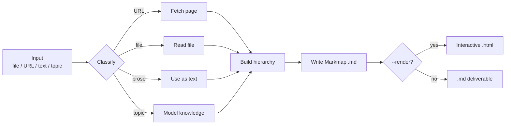
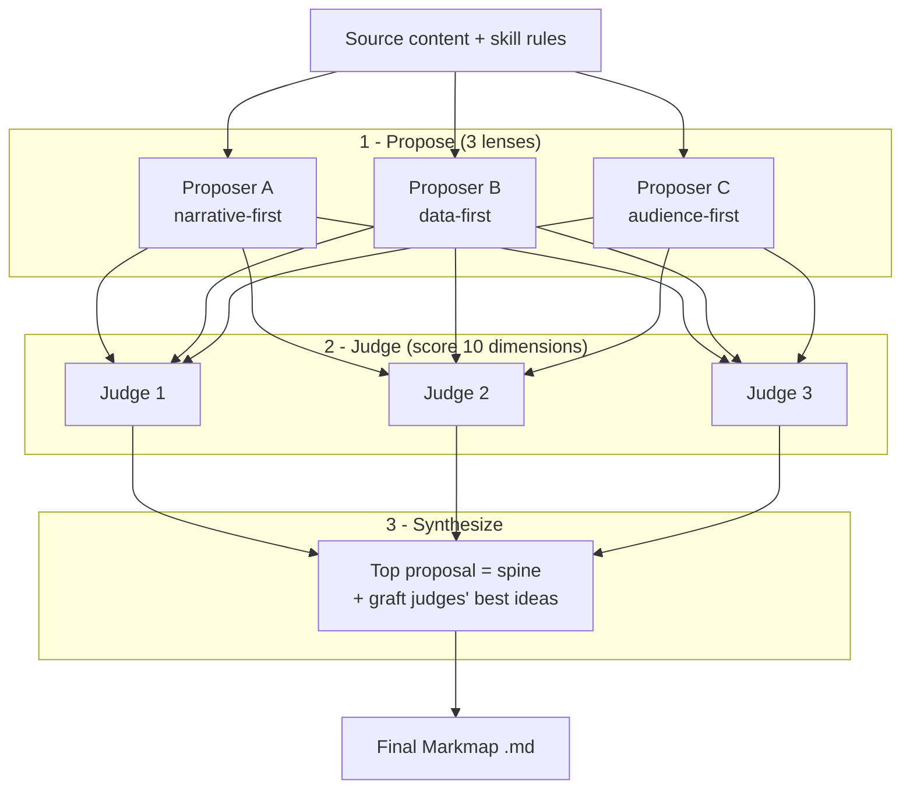

# Usage and advanced features

[README](../README.md) | [Chinese](usage.zh.md) | [Installation](installation.md)

## Compatibility

The skills describe capabilities rather than fixed tool names. They are intended for coding agents that support Agent Skills; installing with `npx skills` does not guarantee every feature works on every agent.

| Feature | Requirements | When unavailable |
|---|---|---|
| Basic `.md` output | Inspect paths and create files; read files for file input. | Explain the missing capability or permission and ask how to proceed; do not claim a file was saved. |
| URL input | Retrieve page content. | Ask for pasted content, a retry, or an explicitly chosen topic-based map. |
| `--render` | Execute the supplied helper with Bash and Node.js / `npx`. | Keep the `.md`, explain why HTML was not generated, and provide a manual rendering command. |
| `--panel` (`mindmap` only) | Delegate to independent subagents and collect results. | Explain the limitation and ask before switching to single-pass generation. |

The agent's permissions and approvals still apply. Examples use slash-command notation; if your agent does not expose slash commands, invoke `mindmap` or `mindmap-zh` through its supported skill mechanism.

## Inputs and flags

```text
/mindmap <input> [--panel] [--render] [--output <path>]
/mindmap-zh <input> [--render] [--output <path>]
```

| Input | Example | Behavior |
|---|---|---|
| File | `/mindmap report.md` | Reads the file, mirrors its structure, condenses nodes. Writes `report.mindmap.md`. |
| URL | `/mindmap https://example.com/article` | Fetches the page and maps its content. Writes `<page-slug>.mindmap.md`. |
| Pasted text | `/mindmap "notes about X, Y, Z..."` | Extracts concepts into branches. Writes `<title-slug>.mindmap.md`. |
| Topic | `/mindmap "vector databases"` | Generates a map from the model's knowledge. Writes `vector-databases.mindmap.md`. |

| Flag | Behavior |
|---|---|
| `--render` | After writing the `.md`, also produce interactive `.html` (needs command execution, Bash, and Node.js / `npx`). |
| `--output <path>` | Write the `.md` to a specific path instead of the default. |
| `--panel` | Design the structure with independent subagents; `mindmap` only. |

The skill follows an existing outline or groups unstructured content into 4-7 main branches, aiming for 3-4 levels and short node labels. Existing output files are preserved by adding a numeric suffix, including when `--output` is specified.

### Workflow



## Output format

The skill writes [Markmap](https://markmap.js.org)-flavored Markdown: a single `#` root, `##` branches, and nested bullets.

```markdown
---
title: Retrieval-Augmented Generation
markmap:
  colorFreezeLevel: 2
  maxWidth: 300
---

# Retrieval-Augmented Generation

## Indexing
- Chunk documents
- Embed chunks
- Store vectors

## Retrieval
- Embed the query
- Find nearest chunks

## Generation
- Inject context into prompt
```

To view the `.md`, paste it at [markmap.js.org](https://markmap.js.org), open it in VS Code with the [Markmap extension](https://marketplace.visualstudio.com/items?itemName=gera2ld.markmap-vscode), or use `--render` to generate HTML.

## Rendering to HTML

```text
/mindmap "transformer attention" --render
```

This uses the agent's command-execution capability to run the Bash helper [`render.sh`](../skills/mindmap/scripts/render.sh), which calls `npx --yes markmap-cli <file>.md -o <file>.html --no-open`. Open the generated `.html` in a browser to zoom and collapse branches.

**The `.md` is the guaranteed deliverable; HTML rendering is best-effort.** If command execution, Bash, or Node.js / `npx` is unavailable, the skill still writes the `.md`, explains the limitation, and prints a manual `npx` command for an environment with Node.js.

[Node.js](https://nodejs.org) provides `npx`; no global `markmap-cli` install is needed. `npx` fetches it on demand.

## The judge panel (`--panel`)

For complex or high-stakes sources such as papers and long reports, `/mindmap --panel` uses **3 proposers, 3 judges, and 1 synthesizer** instead of a single-pass structure.

The host must support independent subagent tasks. No particular workflow API is required; tasks can run in parallel or sequentially in separate contexts. If delegation is unavailable, the skill asks before continuing without `--panel` rather than simulating independent reviewers.

```text
/mindmap report.md --panel --render
```



### 1. Propose

Three agents each design a full structure through a different lens:

| Lens | Designs the map around... |
|---|---|
| Narrative-first | The source's own arc and section order. |
| Data-first | The headline numbers and evidence, with metrics in **bold**. |
| Audience-first | The punchline first, with every leaf legible on a slide. |

Each proposer tags every node with a format and a render tier:

| Format | Tier | Best for |
|---|---|---|
| Bullet list | `core` | Parallel facts. |
| Bold inline | `core` | Headline metrics, emphasis. |
| Link | `core` | References, repositories, papers. |
| Table | `rich` | Comparisons, benchmark numbers. |
| Code block | `rich` | Formulas, reward functions, code. |
| Checkbox | `rich` | Tasks, limitations, checklists. |

### 2. Judge

Three judges independently score every proposal from 1-5 on ten dimensions: branch count, depth, phrasing, legibility, source fidelity, punchline-first, headline numbers, leaf legibility, visual balance, and format fit. Each judge also identifies each proposal's best idea.

### 3. Synthesize

One synthesizer uses the top-scored proposal as the spine, grafts in the best ideas identified by the judges, and emits the final Markmap `.md`.

**Cost:** the panel spawns about seven agents and is token-intensive. Without `--panel`, the skill uses a fast single pass. The Chinese `/mindmap-zh` skill does not include this flag.

The exact prompts and schemas live in the [judge-panel reference](../skills/mindmap/references/judge-panel.md). See [real examples](../examples/README.md) for panel-generated outputs.

Failed roles are reported explicitly. If all proposers fail, the skill announces a single-pass fallback. If no valid judge scorecards remain or synthesis fails, it asks whether to retry or continue without `--panel`.
