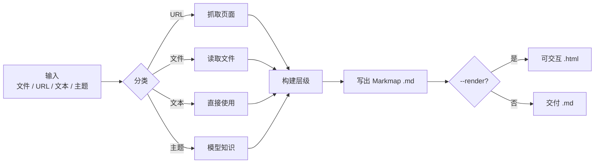
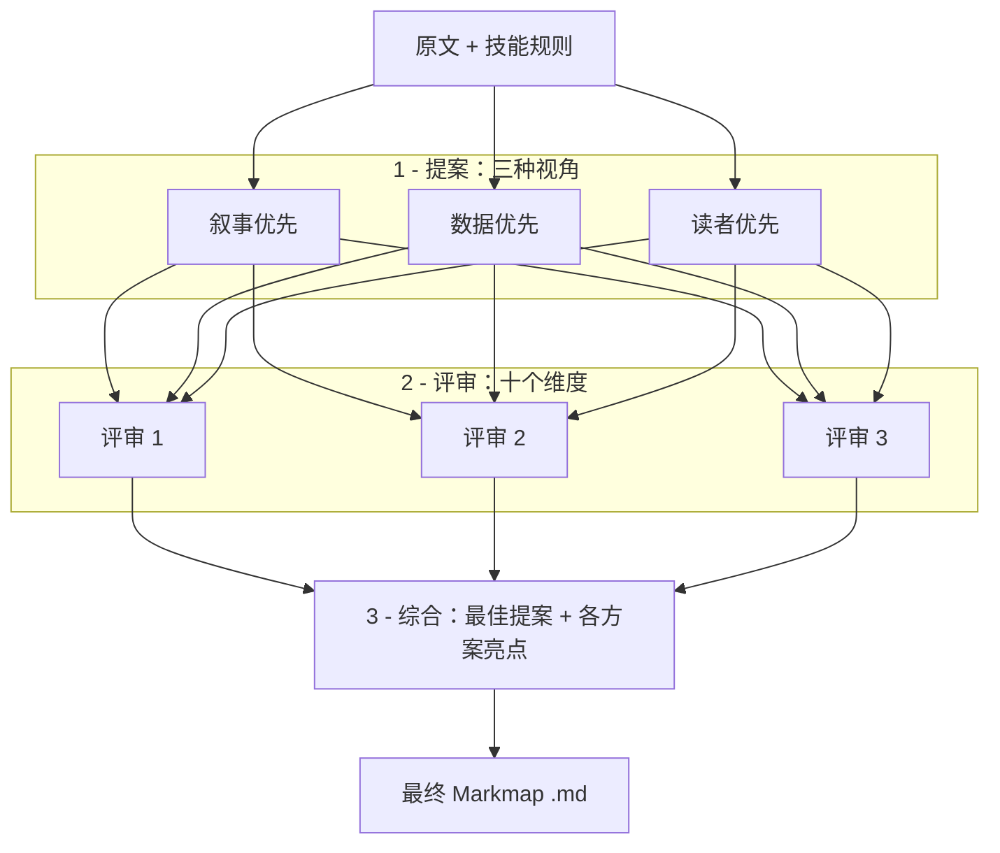

# 使用与高级功能

[README](../README.zh.md) | [English](usage.md) | [安装指南](installation.zh.md)

## 输入与参数

```text
/mindmap-zh <输入> [--render] [--output <路径>]
/mindmap <输入> [--panel] [--render] [--output <路径>]
```

| 输入 | 示例 | 行为 |
|---|---|---|
| 文件 | `/mindmap-zh 报告.md` | 读取文件，沿用其结构，压缩节点。写出 `报告.mindmap.md`。 |
| URL | `/mindmap-zh https://example.com/article` | 抓取页面并映射其内容。写出 `<页面-slug>.mindmap.md`。 |
| 粘贴文本 | `/mindmap-zh "关于 X、Y、Z 的笔记……"` | 提炼概念为分支。写出 `<标题-slug>.mindmap.md`。 |
| 主题 | `/mindmap-zh "向量数据库"` | 基于模型自身知识生成导图。写出 `向量数据库.mindmap.md`。 |

| 参数 | 行为 |
|---|---|
| `--render` | 写出 `.md` 后，同时生成可交互 `.html`（需要 Node.js / `npx`）。 |
| `--output <路径>` | 将 `.md` 写到指定路径，而非默认路径。 |
| `--panel` | 通过多智能体评审设计结构，仅 `/mindmap` 支持。 |

技能沿用已有大纲，或把非结构化内容组织为 4–7 个主分支，目标深度为 3–4 层，每个节点使用短语。若输出文件已存在，会添加数字后缀，即使显式指定 `--output` 也不会覆盖原文件。

### 工作流程



## 输出格式

技能写出 [Markmap](https://markmap.js.org) 风格的 Markdown：单个 `#` 根节点、`##` 分支和嵌套列表。

```markdown
---
title: 检索增强生成（RAG）
markmap:
  colorFreezeLevel: 2
  maxWidth: 300
---

# 检索增强生成（RAG）

## 索引
- 切分文档
- 嵌入片段
- 存储向量

## 检索
- 嵌入查询
- 查找最近邻片段

## 生成
- 注入上下文到提示词
```

查看 `.md` 时，可粘贴到 [markmap.js.org](https://markmap.js.org)，在 VS Code 中使用 [Markmap 扩展](https://marketplace.visualstudio.com/items?itemName=gera2ld.markmap-vscode)，或通过 `--render` 生成 HTML。

## 渲染为 HTML

```text
/mindmap-zh "Transformer 注意力机制" --render
```

底层经由 [`render.sh`](../skills/mindmap-zh/scripts/render.sh) 运行 `npx markmap-cli <文件>.md -o <文件>.html --no-open`。用浏览器打开生成的 `.html` 即可缩放、折叠分支。

**`.md` 始终是有保证的交付物，HTML 渲染是尽力而为。** 若缺少 Node.js / `npx`，技能仍会写出 `.md`，报告已跳过渲染，并提供手动执行命令。

[Node.js](https://nodejs.org) 提供 `npx`；无需全局安装 `markmap-cli`，`npx` 会按需拉取。

## 多智能体评审（`--panel`）

对于论文、长报告等复杂或重要材料，英文技能 `/mindmap` 的 `--panel` 会使用 **3 个提案智能体、3 个评审智能体和 1 个综合智能体**，代替一次性生成结构。

```text
/mindmap report.md --panel --render
```



### 1. 提案

三个智能体分别从不同视角设计完整结构：

| 视角 | 组织方式 |
|---|---|
| 叙事优先 | 沿用原文的叙事脉络与章节顺序。 |
| 数据优先 | 突出关键数字与证据，指标使用**粗体**。 |
| 读者优先 | 结论先行，叶节点在幻灯片上也清晰可读。 |

每个提案还会为节点指定格式与渲染层级：

| 格式 | 层级 | 适用内容 |
|---|---|---|
| 列表 | `core` | 并列事实。 |
| 行内粗体 | `core` | 关键指标、重点。 |
| 链接 | `core` | 引用、仓库、论文。 |
| 表格 | `rich` | 对比、基准数据。 |
| 代码块 | `rich` | 公式、奖励函数、代码。 |
| 复选框 | `rich` | 任务、局限、清单。 |

### 2. 评审

三个评审独立对每份提案按 1–5 分打分，涵盖十个维度：分支数、深度、短语表达、可读性、原文忠实度、结论先行、关键数字、叶节点可读性、视觉平衡与格式适配。每位评审还会指出每份提案的最佳想法。

### 3. 综合

综合智能体以最高分提案为主干，吸收其他方案的亮点，生成最终 Markmap `.md`。

**开销：** 此模式约启动七个智能体，消耗较多 token。不带 `--panel` 时使用快速单次生成；中文版 `/mindmap-zh` 不支持此参数。

完整提示词和数据结构见[评审参考](../skills/mindmap/references/judge-panel.md)，生成效果见[真实示例](../examples/README.md)。
